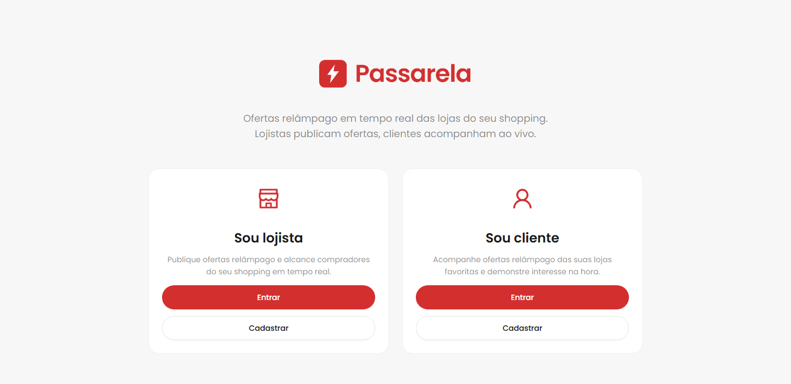
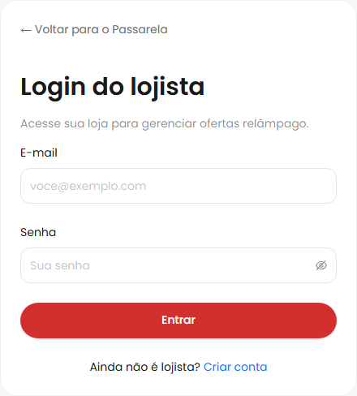
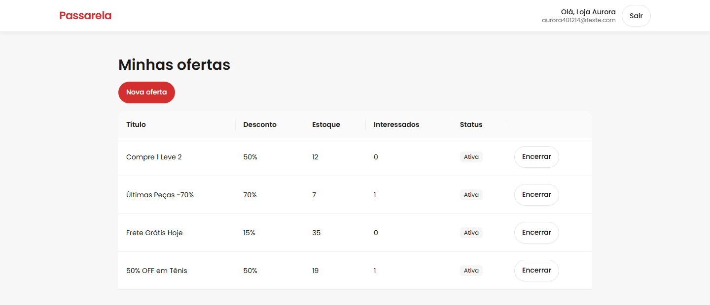
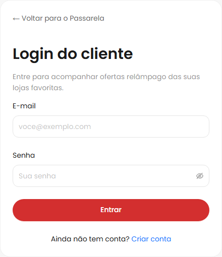
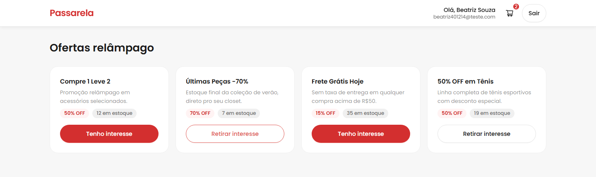

<p align="center">
  
</p>

<p align="center">
  <a href="https://github.com/marcos-asdes/passarela-frontend/actions/workflows/deploy.yml">
    
  </a>
</p>

Interface de uma plataforma onde **merchants** de um shopping publicam flash deals e **shoppers** acompanham em tempo real as promoções ativas, podendo registrar interesse. Projeto desenvolvido em resposta a um desafio técnico para vaga de desenvolvedor fullstack pleno.

## O Desafio

Construir em uma semana um MVP fullstack com dois papéis distintos (merchant e shopper), autenticação JWT, CRUD de ofertas com controle de estoque, notificações em tempo real via WebSocket e expiração automática de ofertas por job agendado.

## Screenshots

| Landing | Login Merchant | Dashboard Merchant |
|---|---|---|
|  |  |  |

| Login Shopper | Feed Shopper |
|---|---|
|  |  |

## Páginas

| Rota | Papel | Descrição |
|---|---|---|
| `/` | — | Landing, direciona para login/cadastro de cada papel |
| `/lojista/entrar` | — | Login do merchant |
| `/lojista/cadastro` | — | Cadastro do merchant |
| `/lojista/painel` | merchant | Dashboard: lista, cria e encerra offers; vê contagem de interessados |
| `/cliente/entrar` | — | Login do shopper |
| `/cliente/cadastro` | — | Cadastro do shopper |
| `/cliente/ofertas` | shopper | Feed: offers ativas, registra interesse, recebe novas offers em tempo real via WebSocket |

`/lojista/painel` e `/cliente/ofertas` são protegidas por `RequireRole` — sem sessão válida ou com papel incorreto, redireciona para `/`.

## Além do Desafio

Pontos implementados além do escopo mínimo do desafio:

### Redux

- Toda chamada de API passa por thunk (`createThunk`), nunca `useState` direto num componente — loading e erro sempre centralizados no Redux.
- Seletores memoizados (`createBranchSelectors`), nunca leitura direta do state num componente.
- Persistência seletiva: só a sessão de login sobrevive a um refresh; formulários e dados de servidor não.
- Estado persistido é criptografado (AES) fora de ambiente de dev.

### Outros pontos relevantes

- Sessão expirada ou revogada é detectada globalmente: um interceptor do Axios pega qualquer `401` inesperado e aciona modal + logout automático.
- Tempo real via WebSocket, por papel: shopper recebe novas ofertas no feed; merchant recebe atualização de status e contagem de interesse.
- Padrão de hook por componente: lógica (estado, efeitos, handlers) sempre num `use<Nome>.ts`; `index.tsx` só renderiza.
- Code splitting por rota (`lazy()`) e tipagem explícita em toda a base.

## Stack Tecnológica

| Camada | Tecnologias |
|---|---|
| Runtime | Node.js 24 LTS |
| Build | Vite |
| UI | React 19 + TypeScript |
| Estado global | Redux Toolkit + react-redux |
| Roteamento | React Router (`react-router-dom`) |
| HTTP | Axios |
| Tempo real | Socket.IO client (`socket.io-client`) |
| Componentes | Ant Design + styled-components |
| Testes | Vitest + Testing Library |
| Containerização | Docker + Docker Compose

## Como Rodar (Docker — preferencial)

```bash
cp .env.example .env
docker compose up --build
```

A aplicação fica disponível em `http://localhost:4000`. Qualquer alteração em `src/` atualiza via HMR, sem rebuild manual da imagem.

## Atalhos Docker (Makefile)

Para agilizar o dia a dia, existe um `Makefile` com os comandos principais:

```bash
make help
make up
make logs
make down
```

Comandos mais usados:

- `make up` / `make up-build` — sobe em background (sem logs; use `make logs` à parte)
- `make start` / `make start-build` — sobe em primeiro plano, com logs ao vivo (Ctrl+C derruba)
- `make build` — builda as imagens sem subir
- `make down` / `make restart`
- `make logs`
- `make ps`
- `make shell`
- `make test`
- `make lint`
- `make clean` — down com remoção de containers órfãos
- `make prune` — clean + remove volumes
- `make rebuild` — rebuild sem cache

Também dá para escolher o serviço nos logs:

```bash
make logs SERVICE=web
```

Se você estiver no Windows sem `make`, use os equivalentes com Docker Compose (ex.: `docker compose up --build`, `docker compose logs -f web`, `docker compose down`).

## Como Rodar (local, sem Docker)

```bash
cp .env.example .env
npm install
npm run dev
```

`VITE_API_URL` no `.env` precisa apontar para o backend em execução.

## Testes

```bash
npm run test           # roda toda a suíte
npm run test:watch     # modo watch
npm run test:coverage  # com cobertura
```

Testes ficam em [`__tests__/`](__tests__/), espelhando a estrutura de `src/` a partir da raiz do projeto (mesma convenção do `backend/`), sufixo `.spec.ts`/`.spec.tsx`.

## Lint e formatação

```bash
npm run lint
npm run format
```

## Path Aliases

Zero imports relativos — sempre via alias: `@/*` aponta para `src/*` e `@test-utils` aponta para o helper de teste em `__tests__/test-utils.tsx`.

## Licença

MIT.
